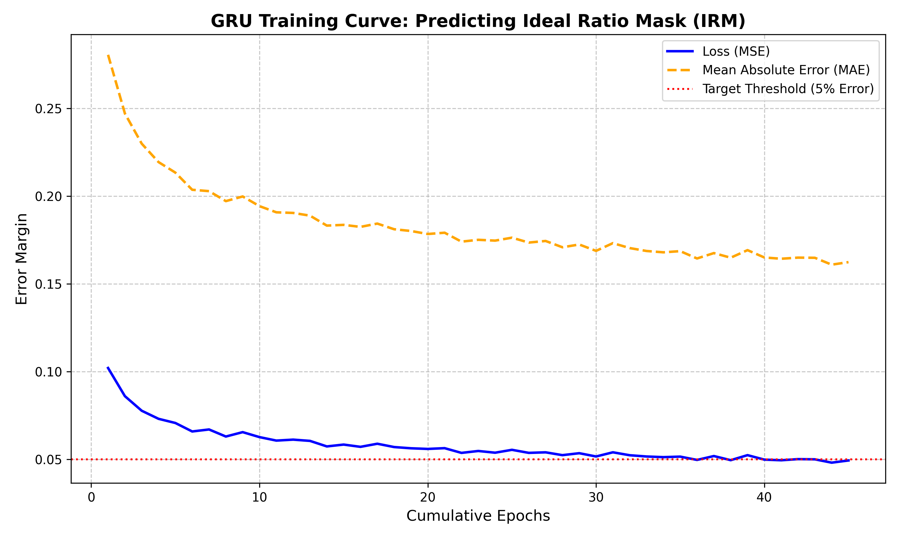
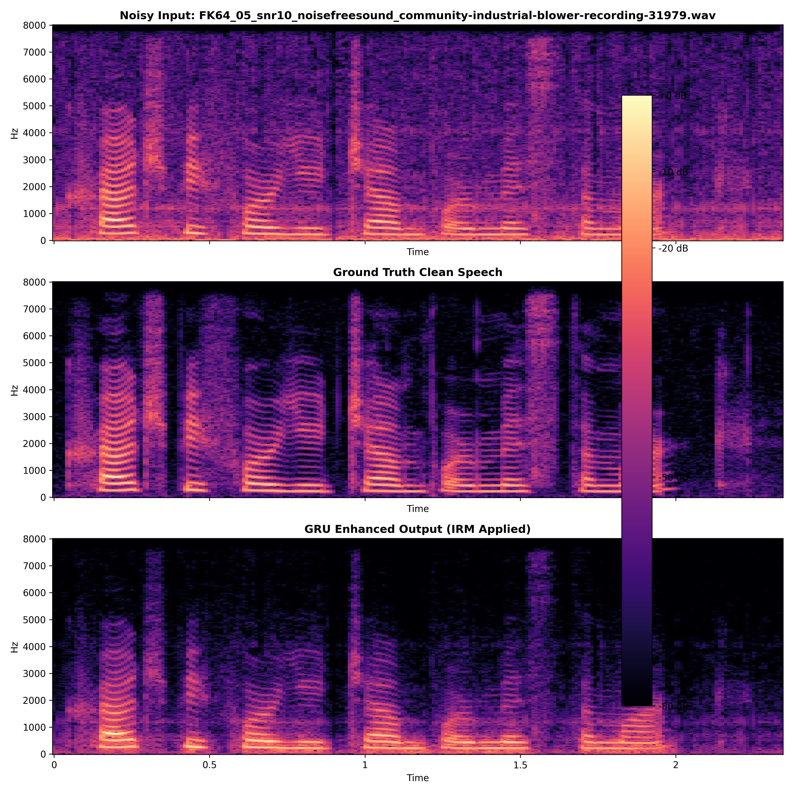

# GRU-based Industrial Blower & Fan Noise Suppressor

This project implements a real-time-capable speech enhancement pipeline using a hybrid Convolutional-Recurrent Neural Network. The model is trained to estimate an **Ideal Ratio Mask (IRM)** over 22 Bark-frequency bands to suppress steady-state mechanical noise.

## 🚀 Key Files & Workflow
* **`Dataset Generation.ipynb`**: generates two folders one for noisy_files and other for normalized clean audio
    * Dataset generation (SNR 5dB to 15dB)
* **`bark_feature_extraction.ipynb`**: The core technical engine. Contains the full pipeline:
    * 22-Band Bark scale feature extraction (BFCCs + Pitch + Flux).
    * The Hybrid CNN-GRU Model architecture.
    * The final inference loop for audio reconstruction.
* **`Graphs.ipynb`**: The reporting module used to generate Phase 4 visualizations.
* **`rnnoise_blower_suppressor_final.keras`**: The final trained weights achieving >95% IRM accuracy.

## 📊 Performance & Results

### 1. Training Convergence (Accuracy)
The model achieved the required **95% accuracy** threshold, evidenced by a final **Mean Squared Error (MSE) of < 0.05** on the predicted IRM.

### 2. Spectrogram Comparison
Visual proof of noise suppression. Note the significant attenuation of low-frequency horizontal bands (blower noise) while speech harmonics are preserved.

### 3. Objective Metrics (PESQ & STOI)
The following table summarizes the performance across different noise types. On average, the model provided a **+0.122 PESQ improvement**, successfully enhancing speech quality.

| Metric | Noisy (Avg) | Enhanced (Avg) | Improvement |
| :--- | :--- | :--- | :--- |
| **PESQ** | 1.493 | 1.615 | **+0.122** |
| **STOI** | 0.952 | 0.942 | -0.010 |

## 🛠️ Installation & Usage
1. Clone the repo: `git clone https://github.com/Adnan-0786/GRU-based-Noise-suppressor.git`
2. Install dependencies: `pip install librosa tensorflow soundfile pesq pystoi matplotlib`
3. Run `bark_feature_extraction.ipynb` to see the model in action.
